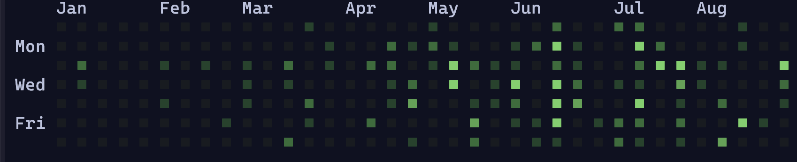
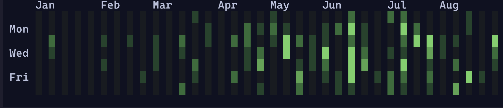
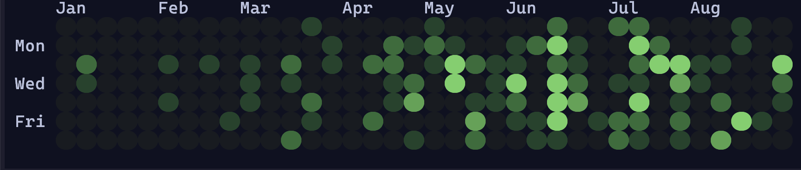
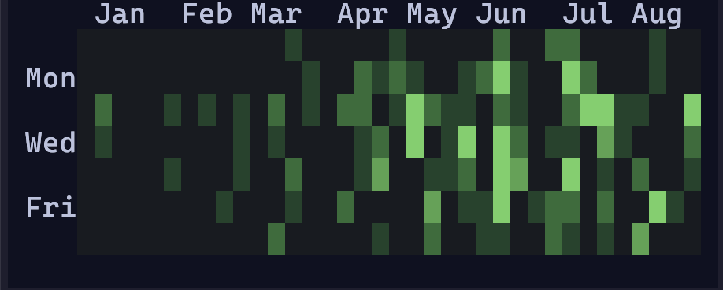
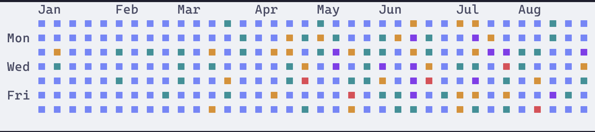

# gitcal

A CLI tool for calendar visualization

# Installation

```shell
cargo install gitcal --locked
```

# Usage

```shell
Usage: gitcal [OPTIONS]

Options:
      --username <NAME>       GitHub username (defaults to token owner)
      --block                 Use block icons
      --half                  Use block icons without spaces
      --circle                Use circle icons
      --base <HEX>            Set base color
      --text <HEX>            Set text color
      --color0 <HEX>          Set color for no contributions
      --color1 <HEX>          Set color for first quartile
      --color2 <HEX>          Set color for second quartile
      --color3 <HEX>          Set color for third quartile
      --color4 <HEX>          Set color for fourth quartile
      --ytd                   Display the past year's worth of data
      --month                 Display the past month's worth of data
      --token <GITHUB_TOKEN>  GitHub PAT token (uses $GITHUB_TOKEN if not specified)
      --hide-days             Hide day-of-the-week string
      --hide-months           Hide months in header
  -h, --help                  Print help
```

## GitHub Token

To use this, you need an API token for GitHub. This can be created by going to GitHub, then `Settings > Developer Settings > Personal access tokens`. Current advice from GitHub recommends making a [`fine-grained token`](https://github.com/settings/tokens?type=beta). This token should be passed to `gitcal` via `--token` argument, or you can set the `$GITHUB_TOKEN` environment variable.


# Options

## Display Modes
There are several unicode characters which can be used to display the calendar information. See the images below for examples of each:

`(default)`


`--block`


`--circle`


`--half`


## Colors
Custom colors can be used by passing them as hex strings to the respective CLI arguments. For example, `gitcal --base "#FFFFFF"` will make the background color white.

```
gitcal --base "#eff1f5" --text "#4c4f69" --color0 "#7287fd" --color1 "#179299" --color2 "#df8e1d" --color3 "#e64553" --color4 "#8839ef"
```


## Hiding Headers
The `--hide-days` and `--hide-months` arguments can be used to hide the respective day column and month row.

## Time

By default, `gitcal` will display past 365 days of information. However, the `--ytd` and `--month` arguments can be used to instead use the year-to-date starting at January 1st or the days since the beginning of the month respectively.
